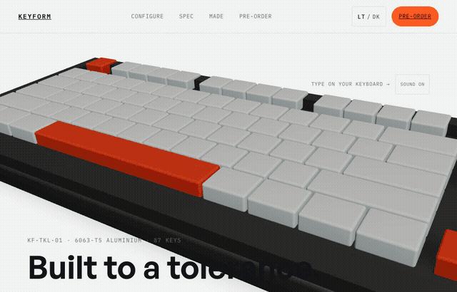
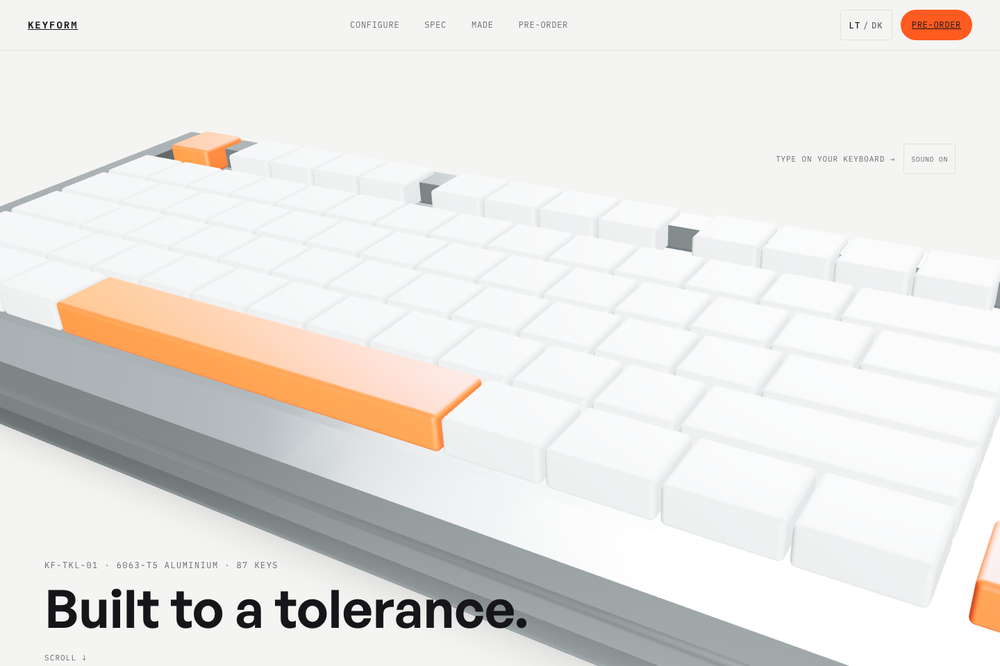
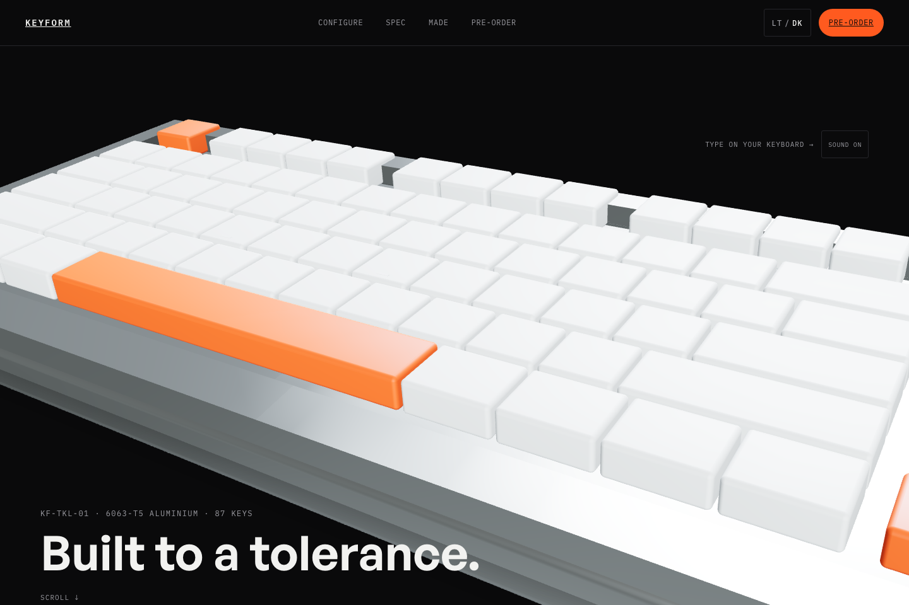
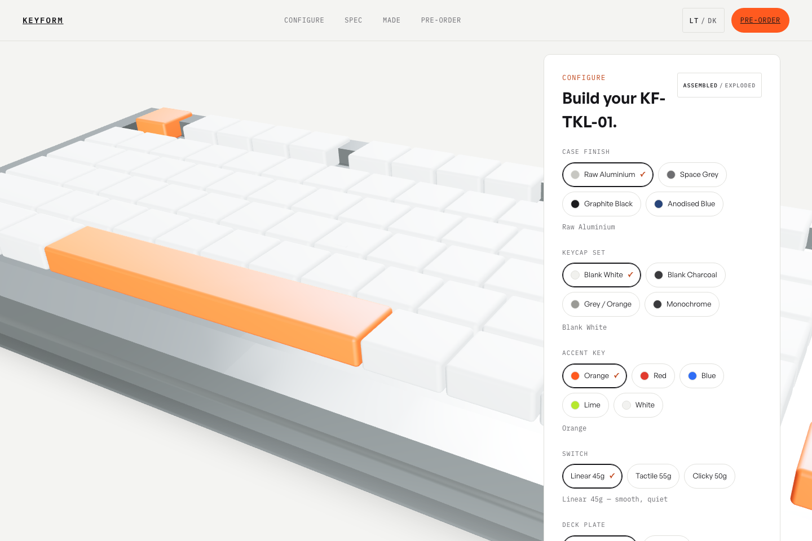
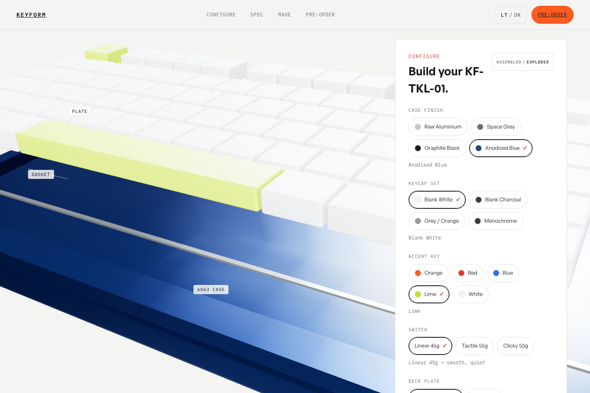
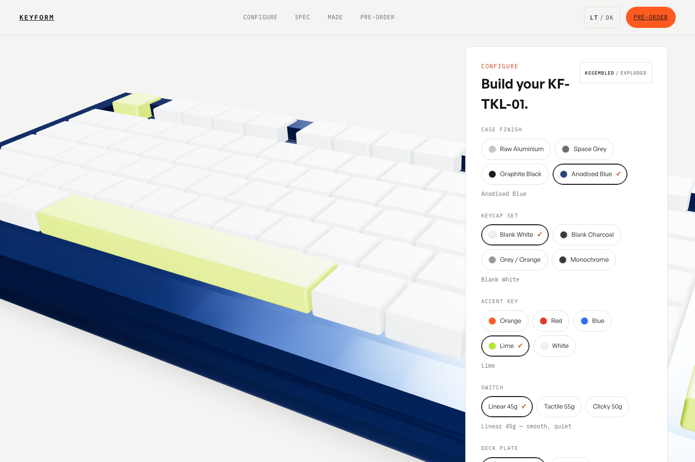
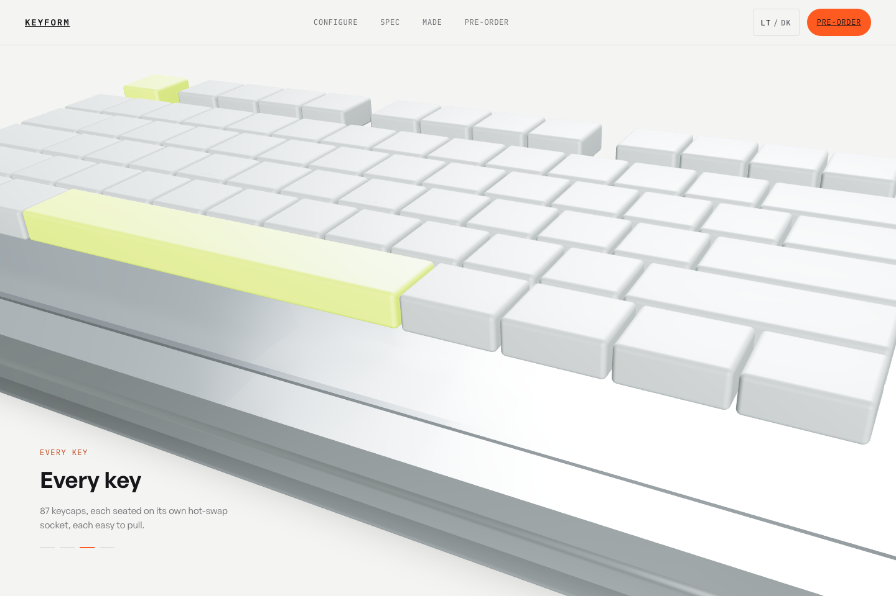

# KEYFORM — KF-TKL-01

A concept marketing site for a fictional CNC-machined mechanical keyboard, built around a
real-time 3D configurator. Portfolio piece by [Sajj Studio](https://sajjstudio.co.uk).

**Live:** https://keyform-one.vercel.app

This is not a real product. There is no checkout. It's a demonstration of a working 3D
product configurator — build the board, watch the material and price update live, blow it
apart to see the stack, then scroll through how it's made — built entirely with free,
open-source tools.



| | |
|---|---|
|  |  |
|  |  |
|  |  |

## What it does

- **Configure**: case finish, keycap set, accent colour, switch type and deck plate —
  five real radio groups, each one recolouring or repricing the live 3D board.
- **Explode**: a toggle drops the case, separates the plate and lifts all 87 keycaps in a
  staggered wave, with leader-line labels pointing at the parts.
- **Type**: type on your physical keyboard and the matching key on screen presses down,
  glows, and clicks — the click sound changes with the selected switch.
- **Scroll**: the "Made" section pins the board and scrubs the same explode/reassemble
  sequence to your scroll position across four beats.
- **Price + cart**: the total updates live; "Add to cart" opens a drawer that states
  plainly this is a concept with no real checkout.

## Stack

- [Vite](https://vitejs.dev/) + React 19 + TypeScript
- [react-three-fiber](https://r3f.docs.pmnd.rs/) + [drei](https://github.com/pmndrs/drei) — the 3D scene
- [three.js](https://threejs.org/)
- [GSAP](https://gsap.com/) + ScrollTrigger — colour tweens, the exploded-view timeline, the scroll story
- [Lenis](https://lenis.darkroom.engineering/) — smooth scrolling, synced to ScrollTrigger
- [Zustand](https://github.com/pmndrs/zustand) — theme, configurator, audio and scroll-story state
- Fonts: [General Sans](https://www.fontshare.com/fonts/general-sans) (Fontshare) for display/body,
  [IBM Plex Mono](https://fonts.google.com/specimen/IBM+Plex+Mono) (Google Fonts) for technical UI
- Deployed on [Vercel](https://vercel.com/), with CI running typecheck + build on every push

See [CREDITS.txt](CREDITS.txt) for the full asset/licence breakdown — there are no paid
assets anywhere in this project.

## How the procedural keyboard is built

Nothing about the keyboard is hand-placed. The whole ANSI TKL layout (87 keys) is data:

```
src/three/layout.ts     — the layout data + placement maths
src/three/dimensions.ts — every physical constant (key size, case margins, recess depth…)
src/three/Keycap.tsx    — one keycap mesh, given a key from the layout
src/three/Case.tsx      — the case slab, rim, plate trim and USB-C notch
src/three/Keyboard.tsx  — assembles Case + a loop over every key in the layout
```

**The layout.** Each row (function row, number row, top row, home row, bottom row,
modifier row) is written as a list of key widths and gaps, in u (1u = 19.05mm) — exactly
how you'd write out a physical keyboard's spec sheet. A single `layoutRow()` function walks
each list left-to-right, accumulating an x position per key. The nav cluster (Ins/Home/PgUp,
Del/End/PgDn) and arrow cluster are positioned relative to the main block's own computed
width, with the same 0.25u gutter a real TKL case uses to separate the blocks. Running the
numbers back out of this data gives exactly 87 keys — the same number a real ANSI TKL has —
which is a nice sign the maths matches reality rather than being fudged to fit.

**The geometry.** `Keyboard.tsx` maps over that same layout array and renders one
`Keycap` per entry — no instancing, because each key needs to be individually recoloured
(configurator) and individually animated (type-test press, exploded-view lift). The case
is a base slab plus four "rim" bars that are only raised over the margins, so the key area
reads as a genuine recessed tray without any CSG boolean operations — just careful geometry
placement.

**The state.** Five configurator options live in a Zustand store
(`src/store/configurator.ts`), backed by a plain data module
(`src/store/options.ts`) that maps each option to a colour and a price delta. Colour
changes never touch React's own prop-diffing — materials are shared `THREE.Material`
instances tweened directly via `gsap.to(material.color, …)` (see
`src/hooks/useMaterialColorTween.ts`), so every change animates instead of snapping, and
Phase-4's exploded view and Phase-7's scroll story can drive the exact same case/plate/key
mesh groups without fighting each other (a `scrollStory` store flag arbitrates which one is
currently in control).

**One canvas, all the way down.** There's exactly one `<Canvas>` on the whole page,
mounted once in `src/three/KeyboardStage.tsx` as a fixed full-viewport layer sitting behind
everything (z-index 0). The Hero, Configurator and Made sections keep a transparent
background to reveal it; every other section paints its own opaque background over it —
so scrolling past the interactive parts naturally covers the 3D board with no extra
visibility logic, and an `IntersectionObserver` (`useCanvasVisibility`) drops the render
loop to `frameloop="demand"` whenever none of those three sections are in view.

## Controls

- **Orbit**: drag to rotate, scroll/pinch to zoom (zoom is disabled on small screens).
  The board auto-rotates slowly until your first interaction.
- **Type**: click anywhere outside a text field, then type — the matching key presses
  and clicks. Mute with the "SOUND ON" toggle near the hero.
- **Theme**: the LT/DK toggle in the header persists to `localStorage` and otherwise
  follows your OS setting on first load.
- **Keyboard/screen-reader**: the configurator is fully operable without the 3D — real
  `<fieldset>`/radio groups, visible focus, and an `aria-live` region announces every
  change and the running total.

## Local setup

```bash
npm install
npm run dev
```

## Build

```bash
npm run build
npm run preview
```

## Deploy

Deployed to Vercel from this repository; pushes to `main` redeploy automatically.
GitHub Actions runs `npm run build` (which includes the TypeScript check) on every push
and pull request against `main`.

## Performance notes

- Single `<Canvas>`, `dpr` capped ([1, 2] desktop / [1, 1.5] mobile), one shadow-casting
  light (`ContactShadows` is a baked blob, not a real-time shadow).
- Render loop pauses (`frameloop="demand"`) whenever the board is fully covered by an
  opaque section — see "One canvas, all the way down" above.
- three.js + react-three-fiber is a genuinely large dependency (the production bundle is
  ~1.3MB / ~390KB gzipped, almost entirely three's own runtime). That's an accepted
  trade-off for a showpiece like this one; a production site would code-split the 3D
  canvas away from the marketing sections that don't need it on first paint.
- `prefers-reduced-motion` removes auto-rotate, the scroll-scrub, the type-test press
  animation and sound, and makes every colour/explode change instant instead of tweened.

## Status

All phases of the original spec are built: procedural keyboard model, premium
materials/lighting, the five-option configurator with live pricing, the exploded view,
the type-test, the full marketing page, and the ScrollTrigger-pinned "Made" scroll story.
